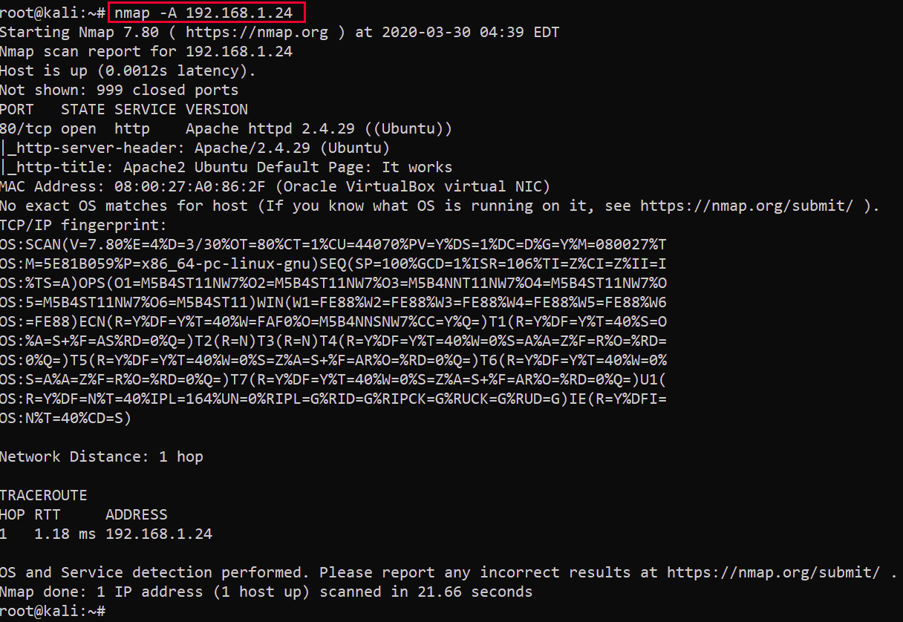

# Capture the Flag - CTF
CTF  - Enumerando, explorando vulnerabilidade, conseguindo shell e posteriormente acesso root.
<h2>Passos seguidos para realizar essa exploração.</h2>

1. Utilizar o **Netdiscover**
2. Escanear portas usando **Nmap**
3. Enumeração da aplicação web com **Dirb**
4. "Exploitando" a vulnerabilidade com código de execução remota **(Remote Code Execution)**
5. Conseguindo shel remota com Python.
6. Explorar permissão de acesso de arquivo e conseguindo acesso root.

# Passo 1: Encontrando o IP da máquina alvo.
  
  O primeiro passo é rodar o Netdiscover para verificar os IPs na rede.
  
  
  
  Como pode-se ver, o endreço IP do alvo é: 192.168.1.24
  
  # Passo 2:
  
  Após conseguir o endereço IP alvo, o primeiro passo é escanear as ṕortas abertas e avaliar os serviços em execução.
  Vamos utilizar o **Nmap**.
  
  
  
  **_comando utilizado nmap -A 192.168.1.24_**
  
  Pode-se ver acima que a porta 80 está aberta, com o serviço http rodando. Também é possível ver algumas informações sobre o sistema alvo.
  
  # Passo 3
  
  Analisando a aplicação rodando na porta 80.

  <h1 align="center">
  
  </h1>
  
  Como pode ser visto na imagem acima, o serviço rodando na porta 80 é a página padrão do **apache**.
  Vamos verificar se há algum arquivo que pode ser explorado. Para isso vamos rodar a ferramenta **Dirb** e enumerar os arquivos da aplicação.
  
  
  <h1 align="center">
  
  </h1>
  
  **_Comando usado dirb 192.168.1.24_**
  
  Alguns arquivos foram encontrados como resultado do scan. Eciste alguns arquivos que retornadram status 200 do servidor.
  Vamos verificar o arquivo **"robots.txt"** no navegador.
  
   <h1 align="center">
  
  </h1>
  
  Podemos ver que há uma entrada incomum no arquivo **_robots.txt_**. Verificando o arquivo no browser:
  
  <h1 align="center">
  
  </h1>
  
  Como podemos ver, **"sar2HTML"** é uma ferramenta  instalada na máquina alvo, sua versão está disponível.
  
  # Passo 4
  
  
  
